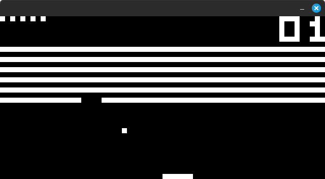

# CHIP8_CPP



CHIP8 interpreter in C++. Initialy written circa 2022.

## Usage

Put your files into the "roms" directory and launch the app.

## Dependencies:

Installing dependencies on Linux:

```sudo apt install cmake libsdl2-dev g++```
